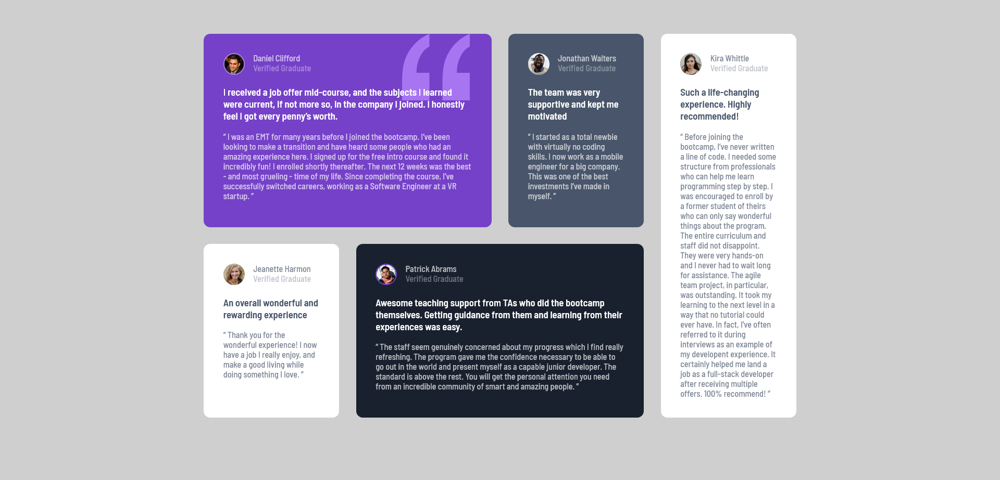

# Frontend Mentor - Testimonials grid section solution

This is a solution to the [Testimonials grid section challenge on Frontend Mentor](https://www.frontendmentor.io/challenges/testimonials-grid-section-Nnw6J7Un7). Frontend Mentor challenges help you improve your coding skills by building realistic projects. 

## Table of contents

- [Overview](#overview)
  - [The challenge](#the-challenge)
  - [Screenshot](#screenshot)
  - [Links](#links)
- [My process](#my-process)
  - [Built with](#built-with)
  - [What I learned](#what-i-learned)
  - [Useful resources](#useful-resources)
- [Author](#author)

## Overview

### The challenge

Users should be able to:

- View the optimal layout for the site depending on their device's screen size

### Screenshot

### Links

- Solution URL: [code on github](https://github.com/yaywonah/Testimonials-Grid)
- Live Site URL: [github pages](https://yaywonah.github.io/Testimonials-Grid/)

## My process

### Built with

- Semantic HTML5 markup
- CSS custom properties
- CSS Grid
- Mobile-first workflow

### What I learned

started: 10:18pm / Nov 27th
ended: 11:13pm

started: 1:50pm / Nov 29th
(30 min tutorial)
- 20 min for lunch
ended: 3:24pm

Use this section to recap over some of your major learnings while working through this project. Writing these out and providing code samples of areas you want to highlight is a great way to reinforce your own knowledge.

### Useful resources

- [relative and absolute position](https://www.youtube.com/watch?v=H04P5YXVssE) - This tutorial taught me more on how to use absolute and relative position properties.

## Author

- Frontend Mentor - [@yaywonah](https://www.frontendmentor.io/profile/yaywonah)

